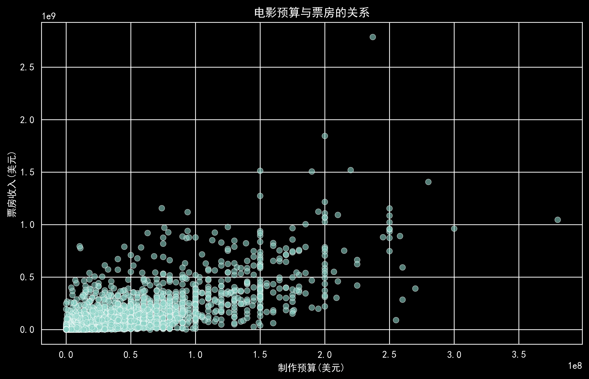
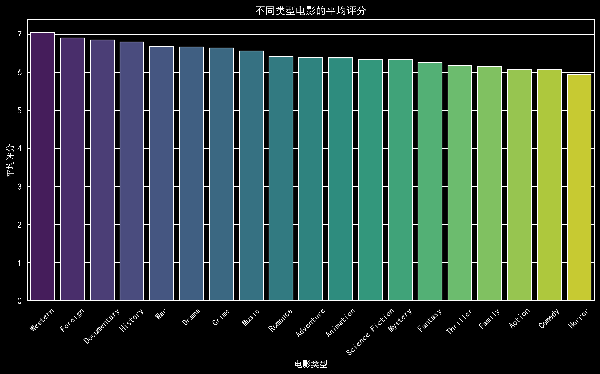
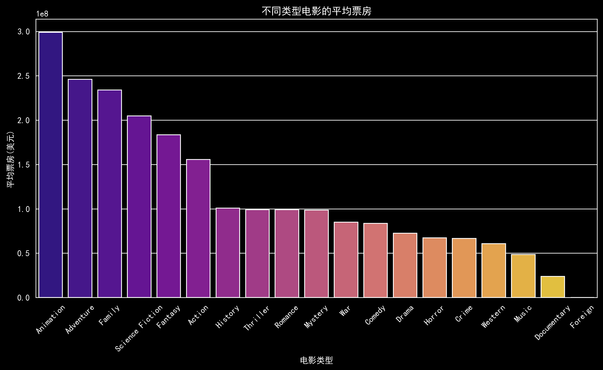
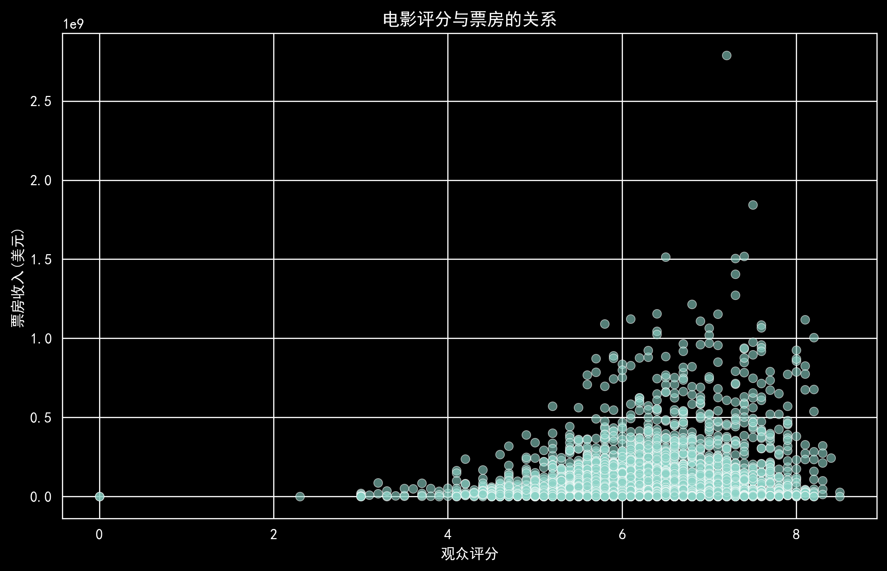
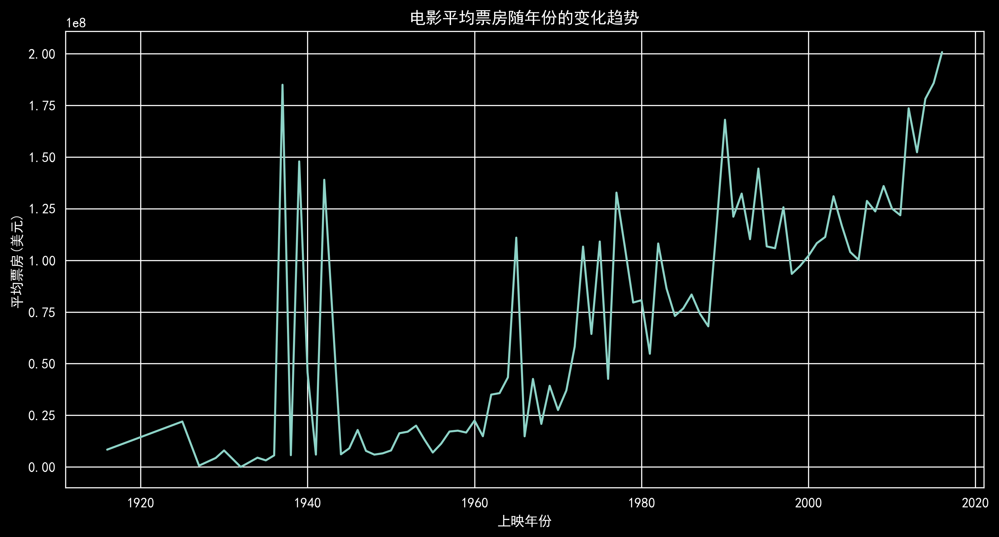
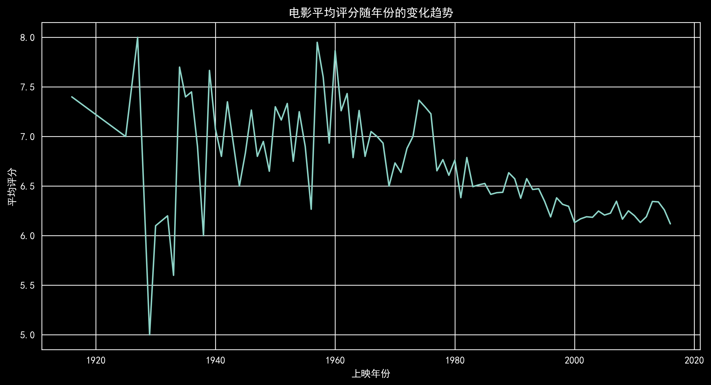
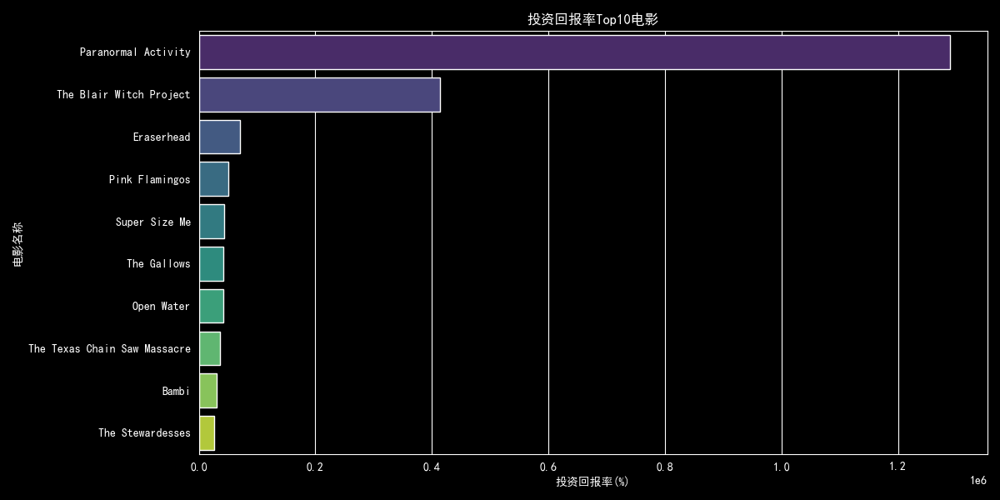
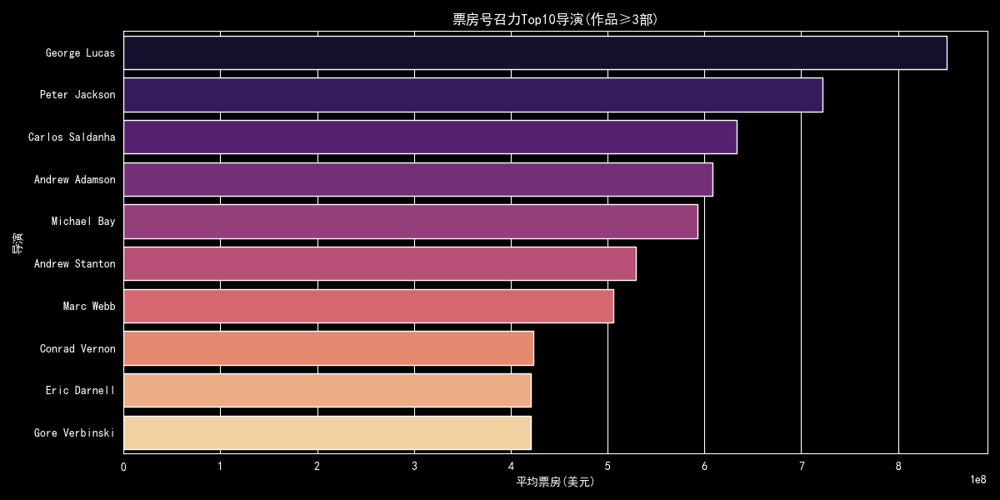
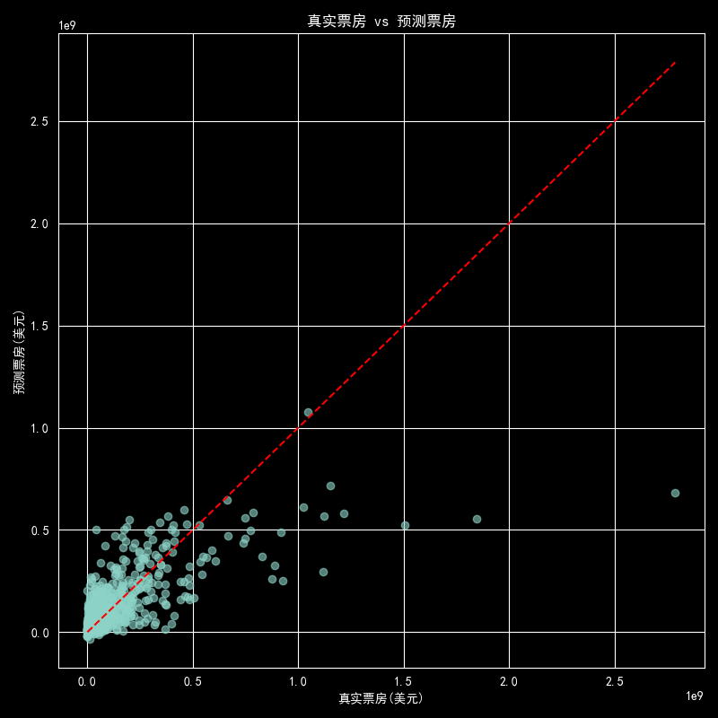

# 电影评分与票房数据分析项目

## 项目简介
本项目基于TMDB 5000电影数据集，通过Python完成数据清洗、多维度可视化分析，探究预算、类型、评分、上映年份对电影票房的影响，分析电影市场的规律与趋势。

## 数据概览
数据集包含近5000部电影的信息，核心字段包括预算、票房、评分、类型、上映日期等，清洗后保留有效数据约3000条。

## 分析结果
### 1. 预算与票房的关系

结论：预算与票房呈弱正相关，说明高预算能一定程度提升票房，但不是决定因素，存在不少低预算高票房的“黑马电影”。

### 2. 不同类型电影的评分与票房

结论：剧情、纪录片类电影平均评分最高，而动作、冒险类电影的平均票房遥遥领先，说明“叫好”和“叫座”的类型偏好存在明显差异。

### 3. 评分与票房的关系

结论：评分与票房几乎无相关性，说明高评分电影不一定高票房，验证了“叫好不叫座”的现象。

### 4. 票房与评分的年份趋势

结论：近几十年电影平均票房整体呈上升趋势，而评分则有小幅下降，可能与电影产量增加、观众口味变化有关。

### 5. 投资回报率(ROI)分析

结论：通过对成本与票房的分析发现，低成本独立电影更容易诞生高回报的“黑马”作品，其中恐怖、伪纪录片等类型尤为突出。以《灵动：鬼影实录》为例，其仅 1.5 万美元的制作成本，最终收获近 2 亿美元票房，投资回报率超过 12000 倍，是低成本创意作品逆袭的典型代表。这说明在有限预算下，内容创意与话题性可以带来远超预期的商业价值。

### 6. 导演票房号召力分析

结论：以作品数量≥3 部为筛选标准，统计了不同导演的平均票房与评分表现。结果显示，乔治·卢卡斯、彼得·杰克逊、迈克尔·贝等商业大片导演，以及卡洛斯·沙尔丹哈、安德鲁·斯坦顿等动画 IP 导演，平均票房显著领先。这反映出成熟 IP、系列化作品和合家欢类型在全球市场的票房稳定性，导演的个人品牌与 IP 运营能力是票房的重要保障。

### 7. 票房预测模型分析

结论：以电影预算、上映年份和类型为特征构建线性回归模型，模型的 R² 分数为 0.48，说明这些基础特征可以解释约 48% 的票房波动。模型对中小成本电影的预测效果较好，但对高票房爆款大片的预测误差较大，这也印证了电影票房受 IP、口碑、宣发等非数据因素影响显著的行业特点。
 ---
综合来看，电影市场呈现出两种典型路径：
 - 低成本创意作品存在逆袭机会，依赖内容和话题性实现高回报；
 - 成熟 IP 与知名导演则是票房稳定的“压舱石”，系列化和合家欢类型更易获得全球市场认可。
 票房预测模型虽无法完全捕捉爆款的偶然性，但能为中小成本电影的投资与制作决策提供有效参考。
## 核心技术栈
- Python / Pandas：数据清洗与处理
- Matplotlib / Seaborn：可视化分析
- JSON数据解析：处理电影类型字段
